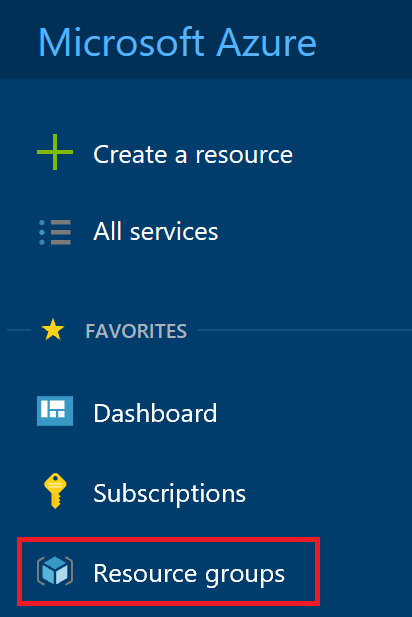
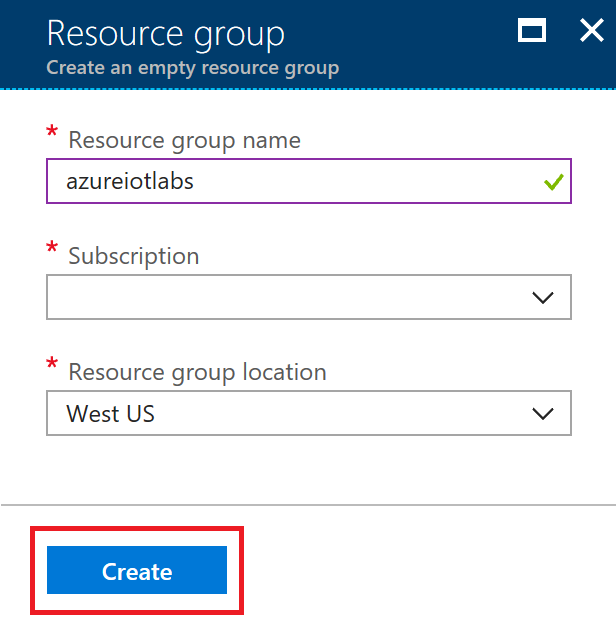
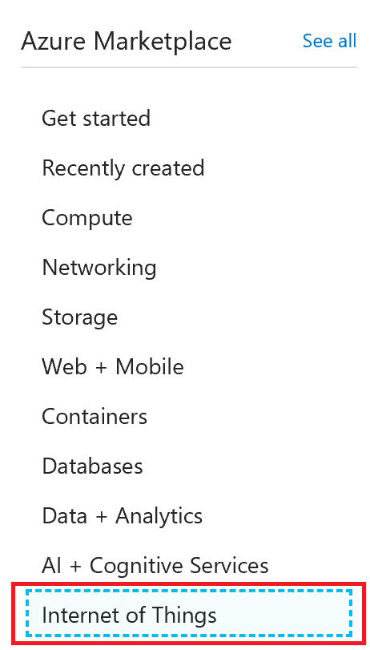
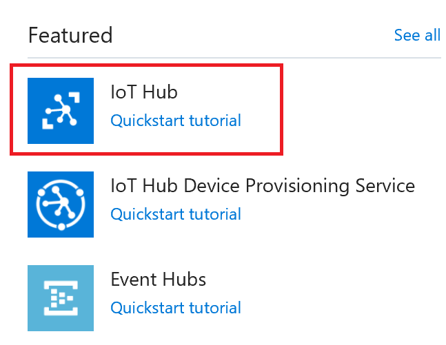
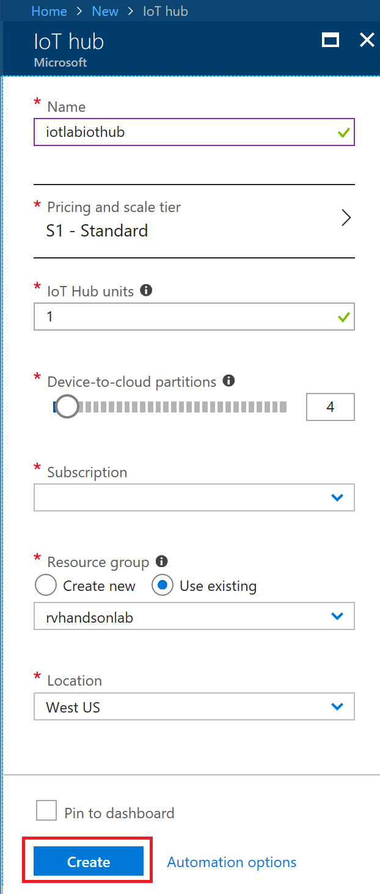
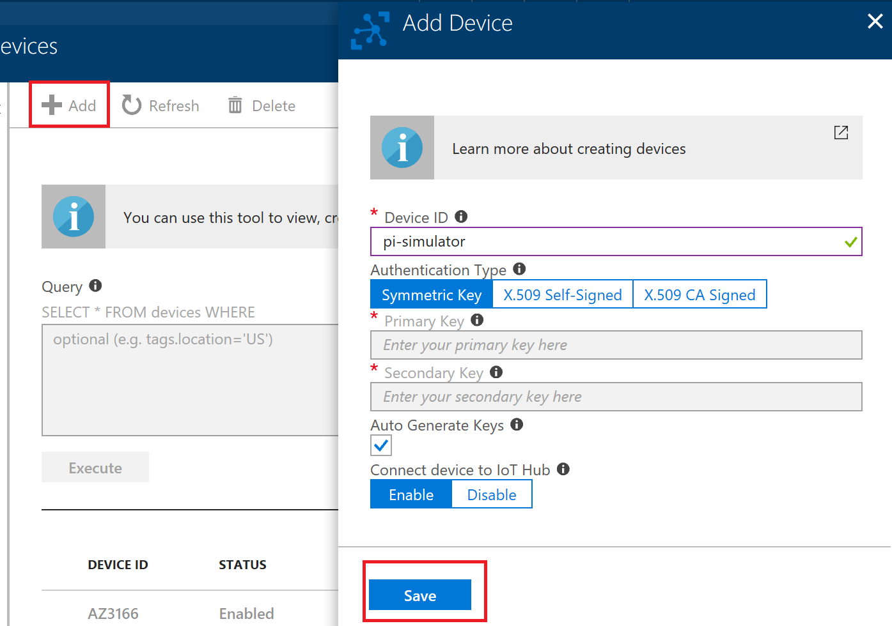
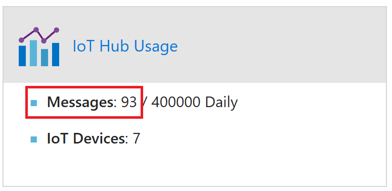

# Introdução ao Azure IoT Hub

O Azure IoT Hub é um serviço totalmente gerenciado que permite comunicações bidirecionais confiáveis e seguras entre milhões de dispositivos IoT e um back-end de solução. Ele permite:

* Fornece várias opções de comunicação de dispositivo para nuvem e nuvem para dispositivo. Essas opções incluem métodos de mensagens bi-direcionais, transferência de arquivos e solicitação-resposta.
* Fornece roteamento interno de mensagens declarativas para outros serviços do Azure.
* Fornece um armazenamento de consulta para metadados do dispositivo e informações de estado sincronizadas.
* Permite comunicações seguras e controle de acesso usando chaves de segurança por dispositivo ou certificados X.509.
* Fornece monitoramento extensivo para conectividade de dispositivos e eventos de gerenciamento de identidade de dispositivos.
* Inclui bibliotecas de dispositivos para os idiomas e plataformas mais populares.

## IoTHub: Conecte, monitore e gerencie bilhões de ativos de IoT

* **Estabelecer** comunicação bidirecional com bilhões de dispositivos IoT
* **Autenticar** por dispositivo para soluções de IoT com segurança avançada
* **Registrar** dispositivos em escala com o Serviço de Provisionamento de Dispositivo do Hub IoT
* **Gerenciar** seus dispositivos IoT em grande escala com o gerenciamento de dispositivos
* **Estender** o poder da nuvem ao seu dispositivo de borda

### Neste laboratório você irá

* Aprenda a criar o Hub IoT

* Aprenda a usar o simulador para se conectar ao Hub IoT e enviar dados

## Criar grupo de recursos

A infra-estrutura do seu aplicativo normalmente é composta de muitos componentes - talvez uma máquina virtual, uma conta de armazenamento e uma rede virtual, ou um aplicativo da Web, banco de dados, servidor de banco de dados e serviços de terceiros.

Você não vê esses componentes como entidades separadas, em vez disso, você os vê como partes relacionadas e interdependentes de uma única entidade. Você deseja implantá-los, gerenciá-los e monitorá-los como um grupo. O Azure Resource Manager permite que você trabalhe com os recursos da sua solução como um grupo. Você pode implantar, atualizar ou excluir todos os recursos da sua solução em uma única operação coordenada.

Crie um grupo de recursos para gerenciar todos os recursos do seu aplicativo para este laboratório

Clique no botão **+ Add**

Informe o nome no campo **Resource group name**,  Escolha a **subscription** e a região no campo **region**

## Crie o IoThub

Clique em **Create a resource** e escolha **Internet of Things**

Clique em **IoTHub**

Certifique-se de selecionar o grupo de recursos que você criou na etapa anterior.

No campo **Name**, insira um nome exclusivo para o seu hub IoT. O nome do seu hub IoT deve ser **exclusivo** em todos os hubs da IoT.

No campo Nível, selecione **F1 tier**.

Você pode escolher entre várias camadas, dependendo de quantos recursos você quer e quantas mensagens você envia através de sua solução por dia. O nível gratuito destina-se a testes e avaliação. Ele permite que 500 dispositivos sejam conectados ao hub IoT e até 8.000 mensagens por dia. Cada assinatura do Azure pode criar um Hub IoT na camada gratuita.

Para detalhes sobre as outras opções de camada, consulte [Choosing the right IoT Hub tier](https://azure.microsoft.com/en-us/pricing/details/iot-hub/).

# Connect PI Simulator to IoT Hub

Conecte um simulador ao seu Hub IoT e transmita dados.

### Neste laboratório você vai

* Aprenda a criar um dispositivo usando o Portal do Azure

* Conecte o simulador ao Hub IoT

* Enviar dados de telemetria para o Azure

## Crie um dispositivo

Vá para o seu Hub IoT no portal e clique em **IoT Devices**

Click on **+ Add** and enter a **Device ID** and click **Save**. 

Clique no dispositivo e copie a string de conexão da chave primária.

Clique no link abaixo para ir ao PI Simulator

[PI Simulator](https://azure-samples.github.io/raspberry-pi-web-simulator/#GetStarted)

Substitua a cadeia de conexão pela cadeia de conexão de chave primária copiada nas etapas anteriores

Depois de copiar a seqüência de conexão deve parecer abaixo

Clique em Executar e comece a enviar mensagens. LED começará a piscar

As mensagens começarão a fluir para o Hub IoT

